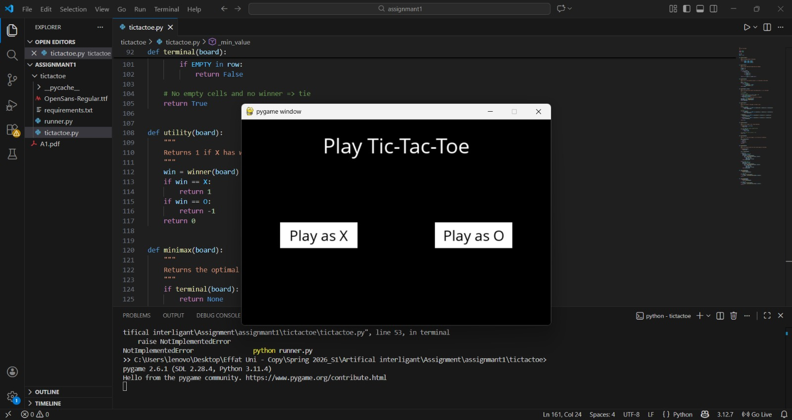
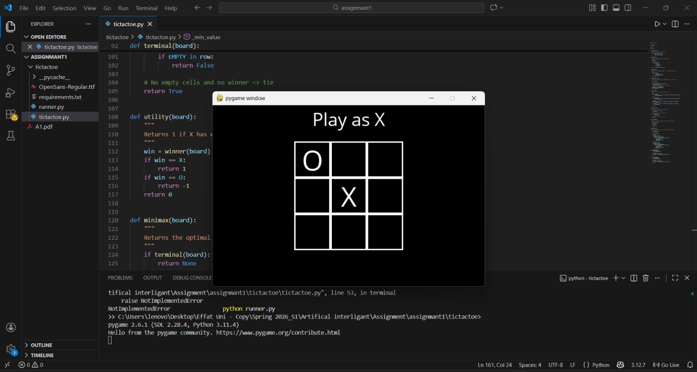
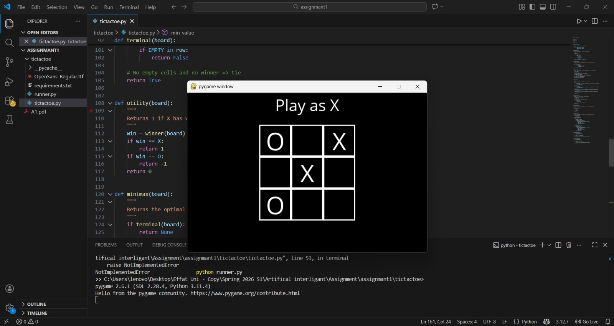
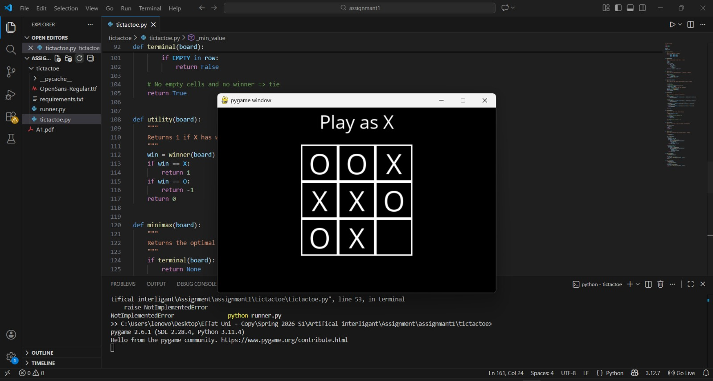
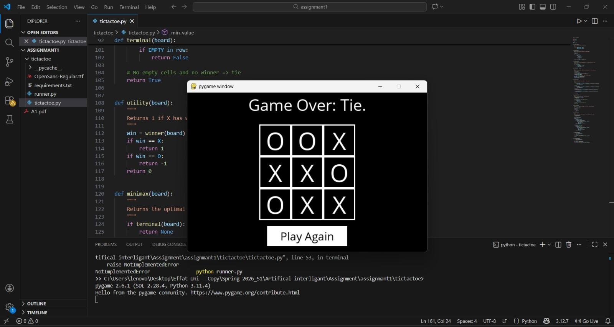

# CS3081 – Assignment 1: Tic-Tac-Toe AI

## 1. Student Information
- Name: Maysoon Idris
- Student ID: S23108474

## 2. Implementation Approach
I implemented the Tic-Tac-Toe AI using the Minimax algorithm.
The algorithm explores all possible game states and chooses the optimal move.
X is treated as the maximizing player and O as the minimizing player.

## 3. Challenges and Solutions
One challenge was avoiding modification of the original board.
I solved this by creating a copy of the board before applying any move.
Another challenge was detecting terminal states correctly, which I solved
by checking for a winner and remaining empty cells.

## 4. Alpha-Beta Pruning (Bonus)
I implemented Alpha-Beta Pruning to optimize the Minimax algorithm.
Alpha and beta values are used to prune branches that cannot affect
the final decision, which improves performance by reducing the number
of evaluated game states.

## 5. Screenshots

## Game Start

## During Gameplay

## Game Over

